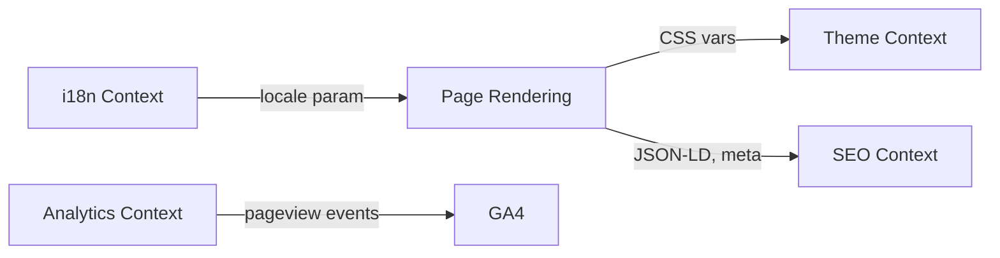
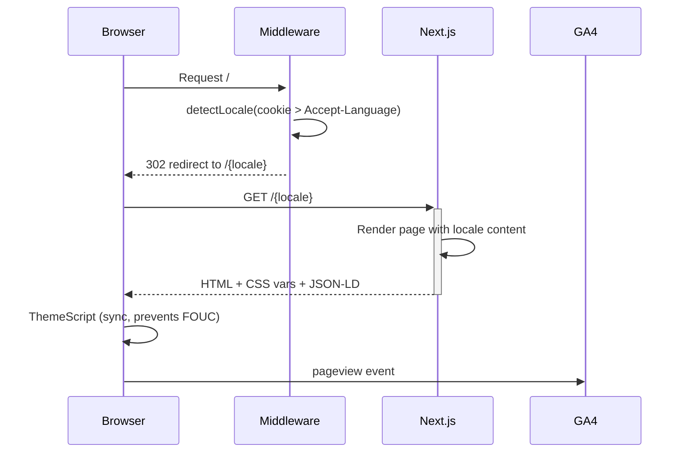

# Architecture — 易澤居 EasyRent (expat-hsinchu-site)

## Domain Model

### Core Domains
- **Content / Marketing Site**: Trilingual landing pages (zh/en/ja) targeting Hsinchu Science Park expats and their employers. Hero, features, process steps, testimonials, blog teasers, CTA sections.
- **i18n / Localization**: Locale detection (cookie > Accept-Language > default zh), prefix-based routing (`/zh`, `/en`, `/ja`), translation strings in `lib/i18n.ts`.
- **SEO / Discoverability**: Structured data (JSON-LD LocalBusiness), sitemap generation, robots.txt, Open Graph / Twitter meta, daily SEO health check script.
- **Theming**: Light/dark mode via CSS custom properties + `localStorage`, FOUC prevention via inline `<script>`.
- **Analytics**: Google Analytics 4 via `NEXT_PUBLIC_GA_ID` env var.

### Bounded Contexts


### Aggregate Roots
| Aggregate | Key Entities | Invariants |
|-----------|-------------|------------|
| Locale | zh, en, ja | Always one of 3 supported locales; cookie persisted for 1 year |
| Theme | light, dark, system | Resolved before first paint; stored in localStorage |
| Page | HomePage (per locale), metadata | Each locale has independent page with locale-specific content, metadata, testimonials |

## System Architecture

### Tech Stack
| Layer | Technology | Version |
|-------|-----------|---------|
| Framework | Next.js (App Router) | 16.1.7 |
| UI Library | React | 19.2.3 |
| Styling | Tailwind CSS | 4.x |
| Icons | Phosphor Icons (@phosphor-icons/react) | 2.x |
| Fonts | Geist, Geist Mono (next/font/google) | — |
| SEO | next-sitemap | 4.x |
| Analytics | Google Analytics 4 | — |
| Deployment | Vercel | — |
| Language | TypeScript | 5.x |

### Data Flow


### Folder Structure
```
.
├── app/
│   ├── layout.tsx         ← Root layout (metadata, fonts, Header/Footer)
│   ├── globals.css        ← CSS custom properties (light/dark), Tailwind
│   ├── robots.ts          ← robots.txt generation
│   ├── sitemap.ts         ← Sitemap generation
│   ├── en/page.tsx        ← English homepage (full page, independent content)
│   ├── ja/page.tsx        ← Japanese homepage
│   └── zh/page.tsx        ← Chinese homepage (default)
├── components/
│   ├── Header.tsx         ← Sticky nav, locale-aware, mobile hamburger
│   ├── Footer.tsx         ← Footer with contact info, JSON-LD
│   ├── ThemeToggle.tsx    ← Light/dark toggle (client component)
│   ├── ThemeScript.tsx    ← Inline FOUC prevention script
│   └── Analytics.tsx      ← GA4 script loader
├── lib/
│   └── i18n.ts            ← Locale config, translation strings (TranslationKey)
├── middleware.ts           ← Locale detection + redirect + cookie
├── public/
│   ├── images/            ← Hero banner, blog cover, logo, property/service banners
│   ├── og-image.png       ← OpenGraph preview image
│   ├── sitemap.xml        ← Generated sitemap
│   └── robots.txt         ← Generated robots
├── seo-logs/              ← Daily SEO health check output
└── seo-daily-check.sh     ← SEO monitoring script
```

## API Contracts

### Existing Endpoints
_No API routes exist._ This is a static marketing site with no backend. All content is hardcoded in page components and `lib/i18n.ts`.

### External Integrations
| Service | Integration | Config |
|---------|------------|--------|
| Google Analytics 4 | Script tag via `Analytics.tsx` | `NEXT_PUBLIC_GA_ID` env var |
| Vercel | Hosting + deployment | Auto-deploy on push |

## User Journey Map

### Primary Flows
1. **Expat Discovery**: Google search → Landing page (en/ja) → Read features → CTA (LINE / Email)
2. **Chinese Landlord**: Google search → Landing page (zh) → Read trust bar + testimonials → CTA
3. **Relocation Agent Referral**: Direct link → Landing page → Contact form
4. **Blog SEO**: Google search → Blog post → Internal link to homepage → CTA

### Key Decision Points
| Step | User Decision | System Response |
|------|--------------|-----------------|
| Initial visit | — | Middleware detects language, redirects to /{locale} |
| Language switch | Click 中/EN/日 | Navigate to locale root, cookie updated |
| Theme toggle | Click sun/moon | Apply CSS class, persist to localStorage |
| CTA click | "Free Consultation" / "LINE" / "Email" | Navigate to /contact (not yet implemented) |
| View Properties | "View Properties" button | Navigate to /properties (not yet implemented) |

### Planned Pages (referenced in nav/sitemap but not yet built)
| Route | Status | Notes |
|-------|--------|-------|
| `/{locale}/services` | Not built | Referenced in nav, sitemap, footer |
| `/{locale}/properties` | Not built | Referenced in nav, sitemap, CTA buttons |
| `/{locale}/blog` | Not built | Referenced in nav, sitemap, zh page has blog teasers |
| `/{locale}/blog/{slug}` | Not built | 3 slugs in sitemap |
| `/{locale}/about` | Not built | Referenced in nav, sitemap, footer |
| `/{locale}/contact` | Not built | Referenced in CTA buttons, nav, footer |

## Product Roadmap Context

### Current Phase
**MVP** — Single landing page per locale, deployed on Vercel. No backend, no dynamic content, no CMS.

### Recent Decisions
- 2026-03: Rebrand from "ExpatHome" to "易澤居 EasyRent"
- 2026-03: i18n via prefix routing + middleware (not next-intl library)
- 2026-03: Dark mode via CSS custom properties (not Tailwind dark: variant)
- 2026-03: Content hardcoded in page files (not CMS/headless)
- 2026-03: Each locale page is a fully independent component (not shared template + translation keys for page body)

### Known Tech Debt
| Item | Impact | Priority | Tracking |
|------|--------|----------|----------|
| 6 pages referenced in nav/sitemap don't exist yet | Broken navigation, 404s | High | — |
| zh page translations in `lib/i18n.ts` are used by Header/Footer but NOT by page body (pages hardcode content) | Dual content sources — Header uses i18n.ts, pages have inline strings | Medium | — |
| ~~No `<html lang>` per locale~~ | ~~Fixed~~ | ~~—~~ | Done (#6, PR #12) |
| ~~No test coverage~~ | 68 E2E tests now | ~~—~~ | Done (#25, PR #28) |
| Hardcoded contact info (LINE ID, WhatsApp, email) in Footer.tsx | Must update in code for changes | Low | — |
| ~~Blog teasers in zh page link to non-existent blog routes~~ | ~~Fixed~~ | ~~—~~ | Done (#22, PR #27) |
| ~~Header nav hover styles hardcode light-mode colors~~ | ~~Fixed~~ | ~~—~~ | Done (#5, PR #11) |
| 2 test artifact files committed (playwright-report/index.html, test-results/.last-run.json) | Minor repo clutter | Low | .gitignore now excludes these; can delete from tree |
| SEO issues: hreflang, sitemap redirect URLs, OG image relative path, conflicting robots.txt | SEO degradation | High | #23 (in progress) |

### Completed Audits (from #1)
| # | Title | Agent | Status |
|---|-------|-------|--------|
| #2 | QA: 全站多語系路由測試 + 操作行為審查 | qa | done |
| #3 | Design: 全站視覺審查（三語 + 三 breakpoint + Dark mode） | design | done |
| #4/#25 | FE: Playwright E2E 測試基礎建設 + 多語系路由 test suite | fe | done (merged PR #28) |

### Completed Fix Tasks (from QA #2 + Design #3 triage)
| # | Title | Agent | Status |
|---|-------|-------|--------|
| #5 | FE: Header dark mode — replace hardcoded colors with CSS vars | fe | done (merged PR #11) |
| #6 | FE: Dynamic `<html lang>` attribute per locale | fe | done (merged PR #12) |
| #7/#22 | FE: Fix all internal links to include locale prefix | fe | done (merged PR #27) |
| #10 | QA: Verify fixes from audit round 1 (#5-#9) | qa | done |

### Active Fix Tasks
| # | Title | Agent | Deps | Status |
|---|-------|-------|------|--------|
| #23 | FE: SEO fixes — hreflang, sitemap, canonical, OG, robots | fe | — | ready |
| #24 | FE: Dark mode polish — process borders, trust bar, card-lift | fe | — | in-progress |
| #26 | QA: Verify fixes round 2 (#22-#24) | qa | #22-#24 | blocked |

### Planned Features (inferred from nav/sitemap)
| Feature | Domain Impact | Dependencies |
|---------|--------------|-------------|
| Services page | New page component per locale | Content from business owner |
| Properties listing | New page, possibly dynamic data | Content source TBD (static vs API) |
| Blog system | New pages, possibly MDX or CMS | Content pipeline decision |
| About page | New page component per locale | Content from business owner |
| Contact page | New page, possibly form + LINE deep link | Form handling decision (static vs API) |

## Failure Modes

| Service Boundary | Failure | Detection | Recovery | User Impact |
|-----------------|---------|-----------|----------|-------------|
| Middleware | Locale detection fails | Default to zh | Cookie fallback | Wrong language on first visit |
| GA4 | `NEXT_PUBLIC_GA_ID` not set | Analytics.tsx returns null | Graceful — no tracking | No analytics |
| ThemeScript | localStorage unavailable | try/catch in inline script | Falls back to light mode | Momentary flash possible |
| Vercel | Deploy fails | Vercel dashboard / GitHub checks | Rollback to previous | Site stays on old version |
| Images | hero-banner.png missing/slow | — | `opacity-40` overlay hides partially | Degraded hero visual |
